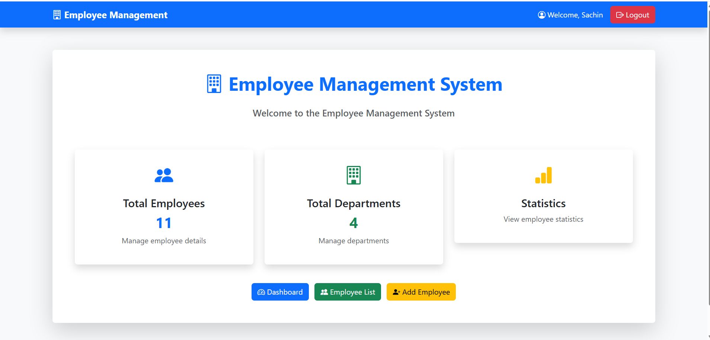
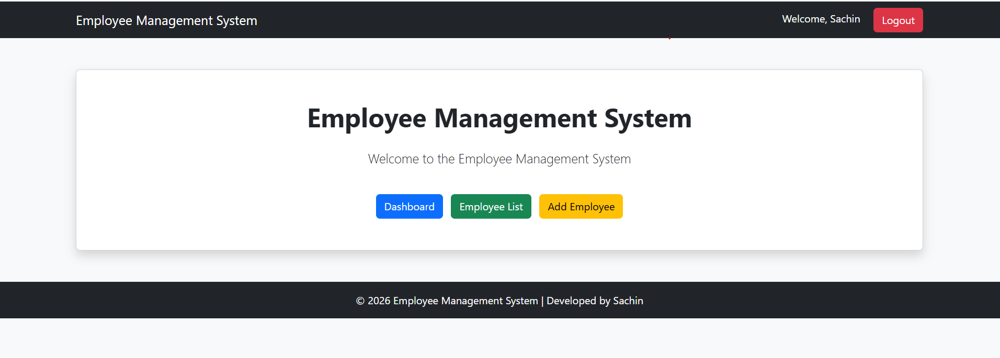
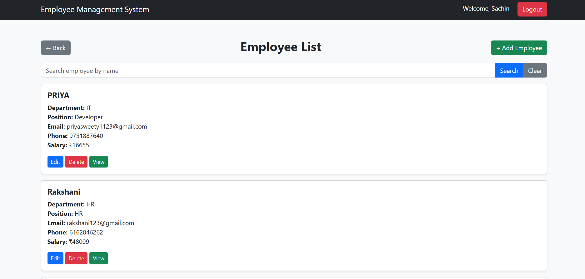
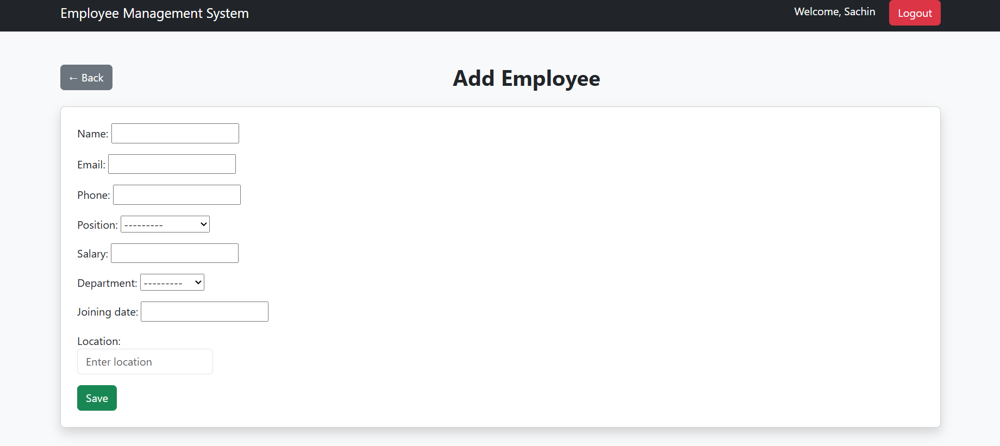
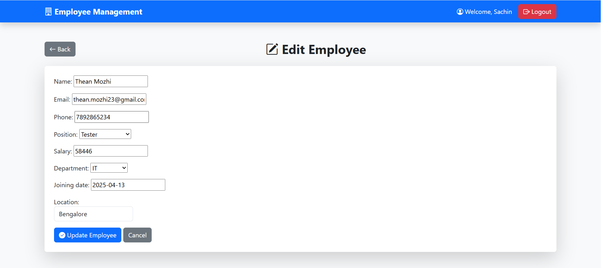
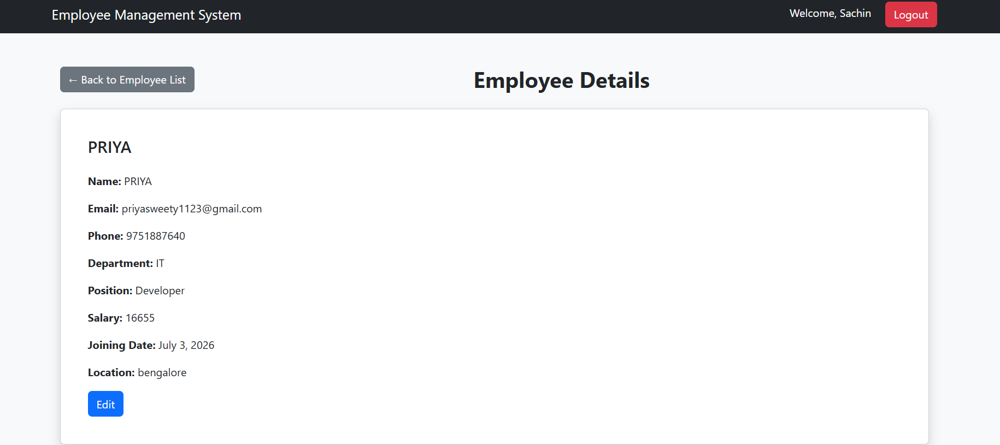

# Employee Management System

A Django-based Employee Management System to manage employee records efficiently.

## Features

- Add employee details
- View employee list
- Edit employee information
- Delete employee records
- Employee detail page
- User login authentication
- Pagination for employee list
- Success messages
- Department and Position management

## Technologies Used

- Python
- Django
- HTML
- CSS
- Bootstrap
- SQLite
- Git & GitHub

## Project Structure

```
EmployeeManagement
│
├── employee_management     # Django project folder
├── employees               # Employee management application
├── screenshots             # Project screenshots
├── db.sqlite3              # Database file
└── manage.py               # Django management file
```

## How to Run

### 1. Clone the repository

```bash
git clone https://github.com/Sachinvelmurugan/EmployeeManagement.git
```

### 2. Go to project folder

```bash
cd EmployeeManagement
```

### 3. Create virtual environment

```bash
python -m venv venv
```

### 4. Activate virtual environment

Windows:

```bash
venv\Scripts\activate
```

### 5. Install dependencies

```bash
pip install -r requirements.txt
```

### 6. Apply migrations

```bash
python manage.py migrate
```

### 7. Create superuser

```bash
python manage.py createsuperuser
```

### 8. Run the server

```bash
python manage.py runserver
```

Open browser:

```
http://127.0.0.1:8000/
```

## Screenshots

### Home Page



### Dashboard



### Employee List



### Add Employee



### Edit Employee



### Employee Details



## Author

**Sachin Velmurugan**

Python Developer | Django Developer